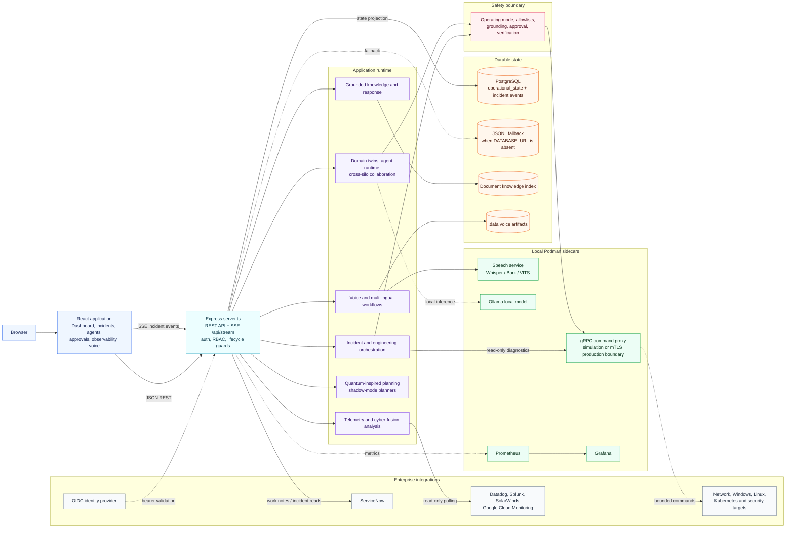
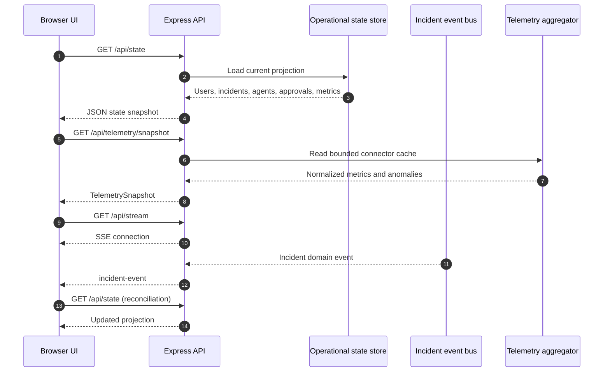
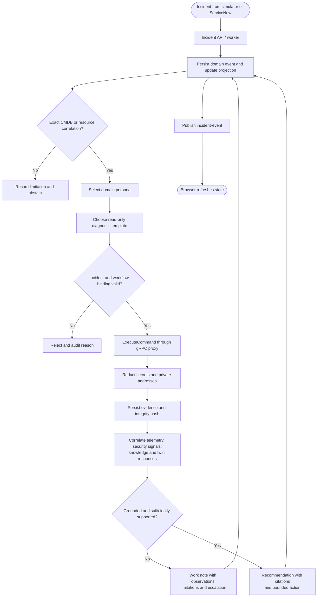
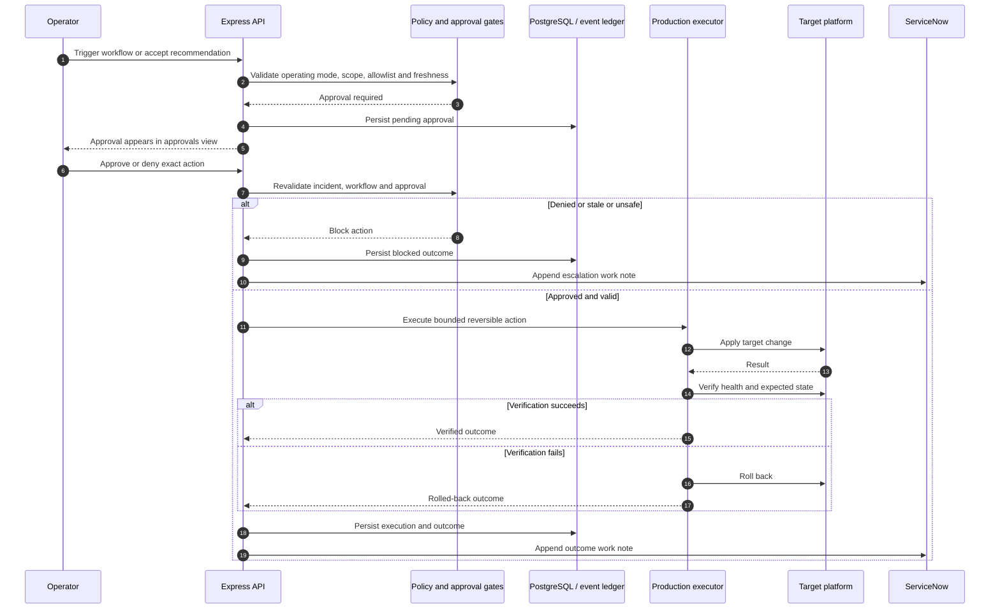
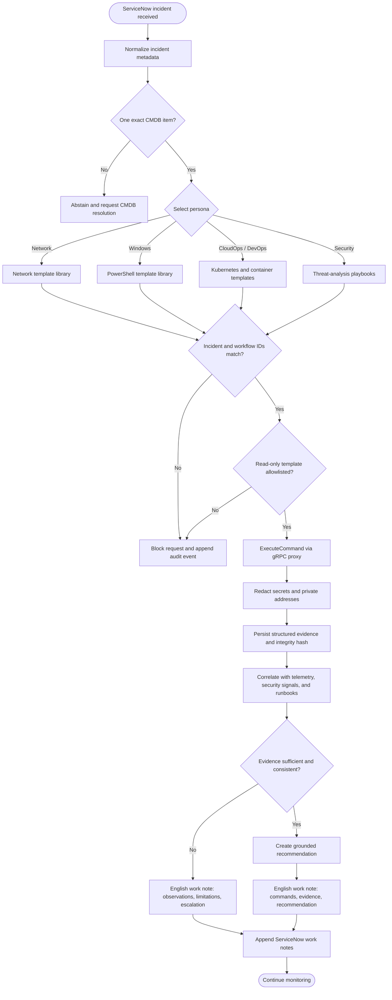
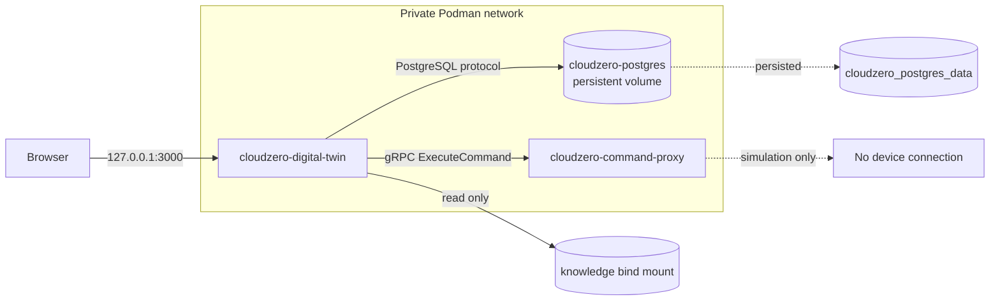

# CloudZero Digital Twin architecture and workflows

These diagrams describe the implemented local Podman architecture and the
intended production control boundaries. Document content and telemetry are data
sources; they are never treated as executable instructions.

## 0. Current application architecture

This view follows the implementation in `src/App.tsx`, `server.ts`, and the
local `compose.yaml` deployment. Solid arrows are request or data paths;
dashed arrows are optional or asynchronous paths.



## 0.1 Browser state and event flow



## 0.2 Incident-to-evidence flow



## 0.3 Remediation and approval flow



## 1. System architecture

```mermaid
flowchart LR
  classDef external fill:#eef4ff,stroke:#2563eb,color:#10204a
  classDef control fill:#f0fdfa,stroke:#0f766e,color:#123
  classDef agent fill:#f5f3ff,stroke:#7c3aed,color:#24104f
  classDef data fill:#fff7ed,stroke:#ea580c,color:#431407
  classDef guard fill:#fff1f2,stroke:#e11d48,color:#4c0519
  classDef execution fill:#ecfdf5,stroke:#16a34a,color:#052e16

  subgraph Sources[Enterprise sources]
    SN[ServiceNow incidents and CMDB]:::external
    TEL[Datadog · Splunk · SolarWinds · Google Monitoring]:::external
    KB[Grounded runbooks and document knowledge]:::external
  end

  subgraph Podman[Local Podman network]
    APP[CloudZero application]:::control
    DB[(PostgreSQL<br/>incident event ledger)]:::data
    GP[gRPC command proxy<br/>simulation sidecar]:::execution
    IDX[(Read-only knowledge index)]:::data
  end

  subgraph Runtime[Digital Twin runtime]
    ORCH[Incident orchestrator]:::control
    CMDB[CMDB correlation]:::control
    ROUTER[Persona router]:::control
    NET[Network Twin]:::agent
    WIN[Windows Twin]:::agent
    CLOUD[CloudOps / DevOps Twin]:::agent
    SEC[Security Twin]:::agent
    FUSION[Cross-domain evidence fusion]:::control
  end

  subgraph Safety[Policy and safety boundary]
    GROUND[Grounding and abstention]:::guard
    REDACT[Secret and private-IP redaction]:::guard
    POLICY[Autonomy policy]:::guard
    APPROVAL[Exact incident + workflow + action approval]:::guard
    VERIFY[Verification and rollback]:::guard
  end

  subgraph Production[Production-only execution plane]
    PXY[Secured gRPC proxy<br/>mTLS + service identity]:::execution
    DEV[Netmiko · PowerShell · Kubernetes · security playbooks]:::execution
  end

  SN --> APP
  TEL --> APP
  KB --> IDX --> APP
  APP --> ORCH --> CMDB --> ROUTER
  ROUTER --> NET
  ROUTER --> WIN
  ROUTER --> CLOUD
  ROUTER --> SEC
  NET --> FUSION
  WIN --> FUSION
  CLOUD --> FUSION
  SEC --> FUSION
  FUSION --> GROUND --> REDACT --> POLICY
  POLICY -->|read-only diagnostic| GP
  POLICY -->|production change| APPROVAL --> PXY --> DEV --> VERIFY
  ORCH <--> DB
  VERIFY --> ORCH
  ORCH -->|English work notes| SN
```



## 2. Incident investigation workflow



## 3. Approval-gated remediation workflow

```mermaid
sequenceDiagram
  autonumber
  participant SN as ServiceNow
  participant O as Orchestrator
  participant A as Domain Twins
  participant P as Policy Engine
  participant H as Human Approver
  participant X as Production Proxy
  participant D as Target Platform
  participant DB as PostgreSQL Audit Ledger

  SN->>O: Incident + CMDB metadata
  O->>A: Investigate with persisted evidence
  A-->>O: Findings + citations + limitations
  O->>P: Proposed signed-runbook action
  P-->>O: Risk, blast radius, and autonomy decision
  O->>DB: Persist recommendation digest

  alt Simulation or shadow mode
    O->>DB: Record recommendation only
    O-->>SN: English work note; no execution
  else Live and approval required
    O->>H: Exact incident/workflow/action approval
    H-->>O: Approval ID and decision
    O->>P: Revalidate approval, evidence freshness, and policy
    alt Validation fails
      P-->>O: Block
      O->>DB: Record blocked reason
      O-->>SN: Escalation work note
    else Validation passes
      O->>X: Apply allowlisted reversible action
      X->>D: Execute within bounded target scope
      D-->>X: Execution result
      X->>D: Run verification checks
      alt Verification succeeds
        X-->>O: Verified
      else Verification fails
        X->>D: Automatic rollback
        X-->>O: Rolled back
      end
      O->>DB: Persist execution and outcome
      O-->>SN: English outcome work note
    end
  end
```

## 4. Local Podman deployment



## Legend

- Blue: enterprise inputs.
- Teal: orchestration and correlation.
- Purple: domain Digital Twins.
- Orange: durable or indexed data.
- Red: safety and approval gates.
- Green: bounded execution components.
